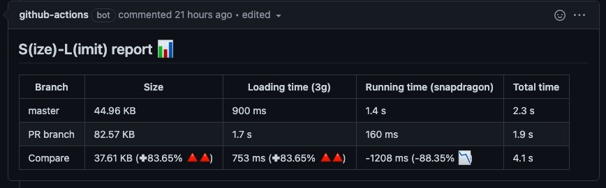

# SLA

[size-limit-action](https://github.com/andresz1/size-limit-action) 을 Remake 한 코드 입니다.

모든 pull request에서 javascript 의 실제 비용을 비교하는 GitHub Action 입니다.



### 사용 방법

1. 이 액션을 이용하고자 하는 프로젝트의 `package.json`에 `@size-limit/preset-app`과 `size-limit`를 설치합니다. (devDependencies 에 설치!)

```shell
npm -D @size-limit/preset-app
npm -D size-limit
```

`package.json`

```json
{
...

"devDependencies": {
    "@size-limit/preset-app": "^5.0.4",
    "size-limit": "^5.0.5"
}

...
}
```

2. `package.json`에 `size-limit` 설정을 추가합니다.

```json
{
...

"devDependencies": {
    "@size-limit/preset-app": "^5.0.4",
    "size-limit": "^5.0.5"
},
"size-limit": [
    {
      "path": "build/static/js/*.js",
      "limit": "1000 kb"
    }
  ]
}
```

3. yml파일을 추가합니다. `.github` 안에 이름은 상관 없습니다.

```yaml
name: pr-size-limit

on:
  push:
    branches:
      - develop
  pull_request:
    types: [opened, synchronize]
  workflow_dispatch:

jobs:
  size-action:
    name: Size action
    runs-on: ubuntu-latest
    env:
      CI: false
      CI_JOB_NUMBER: 1
    steps:
      - uses: actions/checkout@v1
      - uses: Dev-Young-Jae/pr-size-limit@v1.0.0
        with:
          github_token: ${{ secrets.GITHUB_TOKEN }}
          build_script: build
```

4. pr을 요청하고 액션이 잘 돌아가는지 확인합니다.

<hr/>

다시 한 번 말하지만 [size-limit-action](https://github.com/andresz1/size-limit-action) 을 Remake 한 코드 입니다. 코드를 조금 수정하여 배포를 하였습니다.
